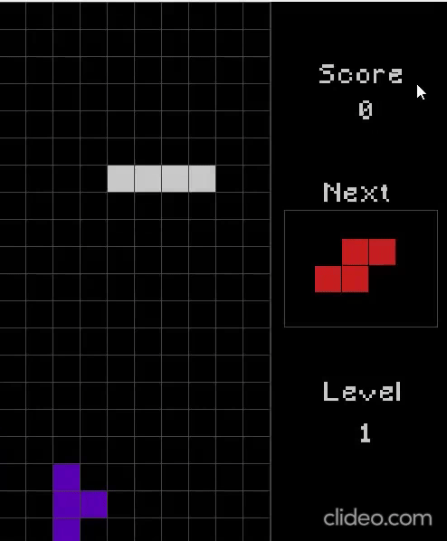

# Tetris

## Getting Started

1. **Prerequisites:** Make sure you have [raylib](https://www.raylib.com/) installed.

2. **Clone the repository:** `git clone git@github.com:hoangnguyen2809/Tetrix.git`

3. **Build and run the game:** 

## Controls

- **Left Arrow:** Move Tetrimino left.
- **Right Arrow:** Move Tetrimino right.
- **Down Arrow:** Accelerate Tetrimino's descent.
- **Up Arrow:** Rotate Tetrimino clockwise.
- **Spacebar:** Instantly drop Tetrimino to the bottom.
